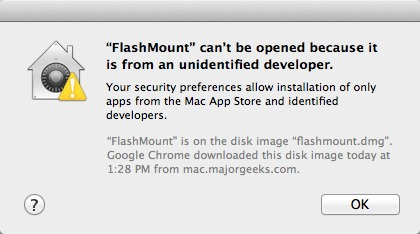

pkginstall
==========

shell script for installing packages via Mac OS X's `installer` program instead of GUI

### A note about quickly mounting DMGs

If you want to automatically mount a DMG without having to click 'yes' to an EULA (if one exists) you can use either use [FlashMount] 
or the `mntdmg` shell script/function below.

Note that under Mac OS X 10.8 you'll need to bypass GateKeeper for FlashMount by control-clicking it and choosing 'Open'. You will only need to do that once:

Here's the `mntdmg` function that I have in my .zshrc:

	mntdmg () {

		FILENAME="$@"

		if [[ -r "$FILENAME" ]]
		then

			EXT="$FILENAME:e"

			MNTPNT=$(echo "Y" |\
						hdid -plist "$FILENAME" 2>/dev/null |\
						fgrep -A 1 '<key>mount-point</key>' |\
						tail -1 |\
						sed 's#</string>.*##g ; s#.*<string>##g')

				# if nothing was mounted, return an error 
			[[ "$MNTPNT" = "" ]] && return 1

				# if something was mounted, give the /Volumes/path/to/it
			echo "${MNTPNT}"
		
		else

				# if the filename does not exist, return an error
			return 1
		fi

	}

Here's the same thing as a shell script:

		#!/bin/zsh -f 
		
		FILENAME="$@"

		if [[ -r "$FILENAME" ]]
		then

			EXT="$FILENAME:e"

			MNTPNT=$(echo "Y" |\
						hdid -plist "$FILENAME" 2>/dev/null |\
						fgrep -A 1 '<key>mount-point</key>' |\
						tail -1 |\
						sed 's#</string>.*##g ; s#.*<string>##g')

				# if nothing was mounted, return an error 
			[[ "$MNTPNT" = "" ]] && exit 1

				# if something was mounted, give the /Volumes/path/to/it
			echo "${MNTPNT}"
		
		else

				# if the filename does not exist, return an error
			exit 1
		fi

		exit
		#EOF
		

[FlashMount]: http://www.tuaw.com/2011/12/30/daily-mac-app-flashmount-quickly-mounts-disk-images/
